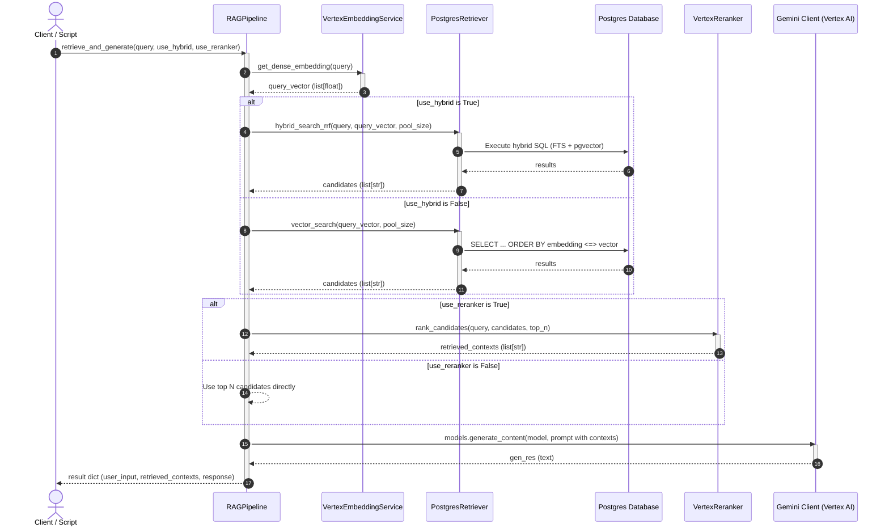
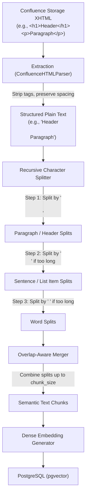

# RAG Pipeline Architecture

This document describes the modular object-oriented design of the RAG pipeline.

## Class Responsibility Table

| Class / Component | Responsibility | Key Methods / API |
| :--- | :--- | :--- |
| **`VertexEmbeddingService`** | Generates 768-dimensional dense vector representation of input text using Vertex AI `text-embedding-005`. | `get_dense_embedding(text)` |
| **`PostgresRetriever`** | Queries PostgreSQL for matching document chunks. Supports pure vector search (pgvector) and hybrid sparse/dense search merged using Reciprocal Rank Fusion (RRF). | `vector_search()`, `hybrid_search_rrf()` |
| **`VertexReranker`** | Reranks Stage 1 candidates using cross-encoder scoring (Vertex AI Semantic Ranker) to eliminate false positives. | `rank_candidates()` |
| **`RAGPipeline`** | Orchestrates the end-to-end RAG flow: embeds the query, retrieves candidates, reranks them, constructs the context prompt, and generates the final answer. | `retrieve_and_generate()` |
| **`db` (Module helper)** | Manages database connection pooling dynamically via `psycopg_pool.ConnectionPool`, supporting both native `google-cloud-sql-connector` and direct TCP socket connections. | `get_pool()`, `get_connection()`, `close_pool()` |
| **`APIConfluenceClient`** | Fetches XHTML storage data and absolute links from Confluence pages using standard HTTP authentication. | `get_page_content_and_links(page_id)` |
| **`RecursiveCrawler`** | Orchestrates BFS crawling starting from a root page, enforcing a maximum depth constraint of 2 and skipping circular references. | `crawl(root_id)` |
| **`RecursiveTextChunker`** | Splits structured plain text into overlap-aware segments using recursive delimiter fallback boundaries (`\n\n`, `\n`, ` `, `""`). | `split_text(text)` |
| **`ConfluenceETLPipeline`** | End-to-end runner that crawls Confluence, chunks text, generates embeddings, and saves outputs in transactions to PostgreSQL. | `run(root_id)` |

---

## Class Interaction Diagram

This sequence diagram illustrates how components interact during a single query lifecycle when `RAGPipeline.retrieve_and_generate(...)` is invoked:

---

## Confluence ETL & Recursive Chunking Architecture

The Confluence ETL (Extract, Transform, Load) component parses unstructured XHTML documents, chunks them while preserving semantic boundaries, and stores them in PostgreSQL.

### ETL Data Flow

This diagram illustrates how raw Confluence storage XHTML is transformed into vector embeddings and ingested:

### Recursive Splitter Delimiter Hierarchy

To maintain the layout structure of documents during RAG indexing, `RecursiveTextChunker` splits text progressively:
1. **`\n\n` (Paragraphs & Headers)**: Isolates separate topics and retains headings together with their following paragraph context.
2. **`\n` (Sentences & List Items)**: Separates bullet-point list items or individual lines, preventing them from being sliced in half.
3. **` ` (Words)**: Splits long sentences or table cell elements at word boundaries, ensuring complete words are never broken.
4. **`""` (Characters)**: Absolute fallback to prevent exceeding `chunk_size` limitations.

Following hierarchical splitting, splits are grouped into cohesive chunks respecting `chunk_size` and `chunk_overlap` constraints, keeping a sliding-window text overlap across chunk boundaries to ensure smooth semantic transitions during retrieval.

