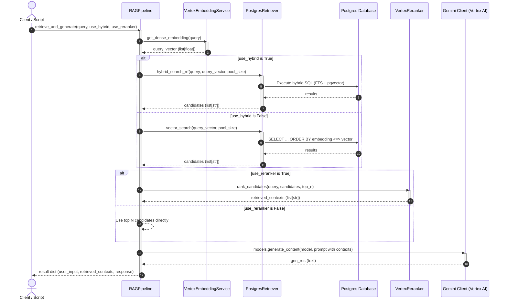

# RAG Pipeline Architecture

This document describes the modular object-oriented design of the RAG pipeline.

## Class Responsibility Table

| Class / Component | Responsibility | Key Methods / API |
| :--- | :--- | :--- |
| **`VertexEmbeddingService`** | Generates 768-dimensional dense vector representation of input text using Vertex AI `text-embedding-005`. | `get_dense_embedding(text)` |
| **`PostgresRetriever`** | Queries PostgreSQL for matching document chunks. Supports pure vector search (pgvector) and hybrid sparse/dense search merged using Reciprocal Rank Fusion (RRF). | `vector_search()`, `hybrid_search_rrf()` |
| **`VertexReranker`** | Reranks Stage 1 candidates using cross-encoder scoring (Vertex AI Semantic Ranker) to eliminate false positives. | `rank_candidates()` |
| **`RAGPipeline`** | Orchestrates the end-to-end RAG flow: embeds the query, retrieves candidates, reranks them, constructs the context prompt, and generates the final answer. | `retrieve_and_generate()` |
| **`db` (Module helper)** | Manages database connections dynamically, using the native `google-cloud-sql-connector` if configured or falling back to TCP socket connections. | `get_connection()` |

---

## Class Interaction Diagram

This sequence diagram illustrates how components interact during a single query lifecycle when `RAGPipeline.retrieve_and_generate(...)` is invoked:

