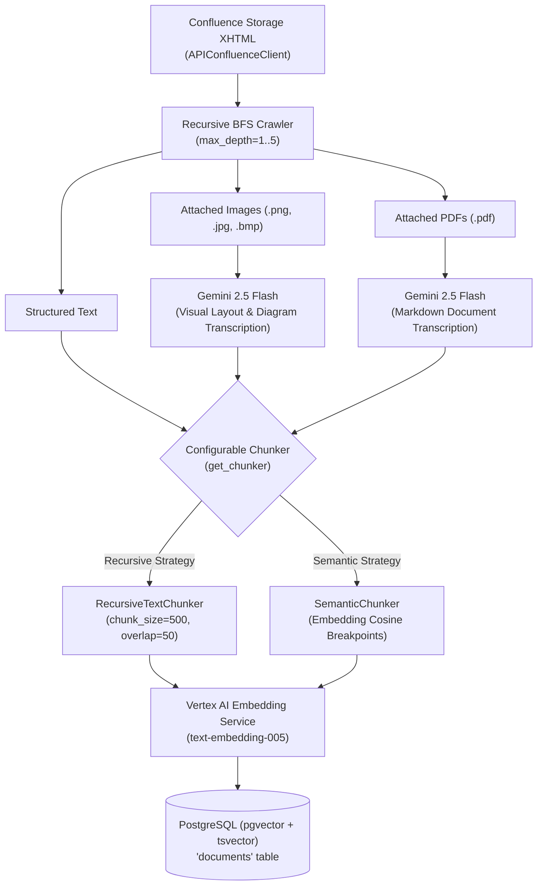
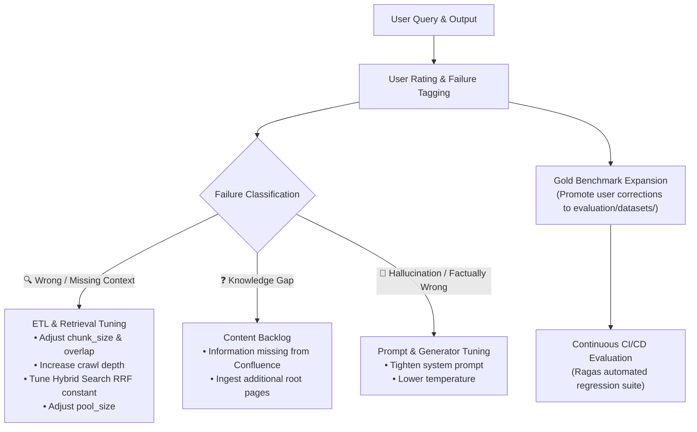

# Confluence ETL Pipeline & Continuous Feedback Loop

This directory contains the **Extract, Transform, and Load (ETL)** pipeline that crawls Confluence spaces, parses multimodal content (structured text, images, PDF documents), generates vector embeddings with Vertex AI, and indexes them into PostgreSQL (`pgvector`).

It also defines how **user feedback** from the interactive Playground feeds back into tuning ETL chunking, crawler depth, and automated regression datasets.

---

## 1. ETL Architecture & Component Overview

| Module | Responsibility | Key Classes / Functions |
| :--- | :--- | :--- |
| [`confluence.py`](file:///Users/ilja/DEV/AI/src/etl/confluence.py) | Scrapes Confluence XHTML, extracts clean text, image tags, and PDF links; manages BFS crawling with depth & cycle control. | `APIConfluenceClient`, `RecursiveCrawler`, `ConfluenceHTMLParser` |
| [`chunking.py`](file:///Users/ilja/DEV/AI/src/etl/chunking.py) | Configurable text chunking strategies: **Recursive** delimiter splitting and **Semantic** embedding distance breakpoint detection. | `RecursiveTextChunker`, `SemanticChunker`, `get_chunker` |
| [`pipeline.py`](file:///Users/ilja/DEV/AI/src/etl/pipeline.py) | End-to-end orchestrator: crawls pages, invokes Gemini for image & PDF transcription, embeds chunks, and saves to PostgreSQL in a transaction. | `ConfluenceETLPipeline` |

### Multimodal Ingestion Flow



---

## 2. Closing the Loop: Utilizing User Feedback for ETL & Retrieval Tuning

In production RAG systems, user feedback collected via the **Playground & Feedback** tab directly drives continuous optimization of the ETL and retrieval pipeline:



### Actionable Troubleshooting Matrix

| Failure Mode Tag | Root Cause | Action in ETL & Pipeline |
| :--- | :--- | :--- |
| **🔍 Missing / Irrelevant Context** | Chunks too small (fragmented ideas) or too large (diluted vector similarity). | • Adjust `pipeline.chunk_size` (e.g. 500 $\rightarrow$ 800) and `pipeline.chunk_overlap` in [`config.yaml`](file:///Users/ilja/DEV/AI/config.yaml).<br/>• Increase `pool_size` in Stage 1 retrieval.<br/>• Check if crawler missed subpages (increase `max_depth`). |
| **❓ Knowledge Gap** | Content does not exist in the database. | • Run ETL on the missing Confluence parent page ID.<br/>• Add the domain/URL to `crawler.allowed_domain_pattern`. |
| **🤥 Hallucination / Wrong Facts** | Retriever succeeded, but LLM ignored context or hallucinated. | • Refine prompt in [`orchestrator.py`](file:///Users/ilja/DEV/AI/src/pipeline/orchestrator.py) to mandate strict adherence to retrieved text.<br/>• Enable or tune Semantic Reranker to remove borderline distracting chunks. |
| **🗣️ Bad Formatting / Incomplete** | Generation parameters or context window limits. | • Increase `final_top_k` or update output formatting guidelines in system prompt. |

---

## 3. Continuous Test Dataset Curation

When domain experts test queries in the Playground and provide a **Corrected Reference Answer**:
1. The feedback is persisted in PostgreSQL (`query_feedback` table).
2. Clicking **"⭐ Promote to Benchmark Dataset"** exports the `(query, reference)` pair directly into `evaluation/datasets/default.json`.
3. Future automated evaluations run with `evaluate_ragas.py` test these exact queries to ensure previous regressions never reappear.

---

## 4. How to Run the ETL Pipeline

### Option A: Via Streamlit Admin UI (Recommended)
1. Launch the dashboard:
   ```bash
   python3 -m streamlit run admin_app.py
   ```
2. Navigate to the **⚙️ ETL Pipeline** tab.
3. Enter the Confluence Page ID or URL, adjust crawl depth and chunking parameters, and click **🚀 Run ETL Pipeline**. Live logs will stream in the expander.

### Option B: Via Command-Line Script
```bash
# Ingest with default strategy (from config.yaml)
python3 scripts/run_etl.py 123456 --max-depth 2

# Ingest specifically using Semantic Chunking
python3 scripts/run_etl.py 123456 --max-depth 2 --strategy semantic

# Ingest specifically using Recursive Chunking
python3 scripts/run_etl.py 123456 --max-depth 2 --strategy recursive
```

