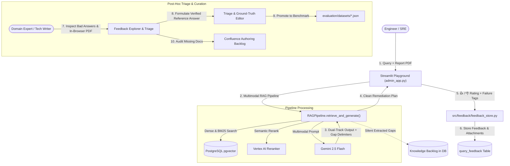

# Interactive Playground, Remediation Workflows & Feedback System

This module provides a production-grade interactive playground and continuous feedback curation loop for the RAG platform. It allows engineers to submit complex diagnostic reports (PDFs, logs, images), receive dual-track grounded remediation workflows, rate answer quality, silently extract internal documentation gaps, and triage failure modes into curated regression benchmark test suites.

---

## Architecture Overview



---

## End-to-End Workflow

### Step 1: Query & Multimodal Report Analysis (🎯 Ask & Rate)
1. **Interactive Inputs**:
   - **Text Query**: Enter a technical troubleshooting request or remediation prompt.
   - **Document Attachment**: Drag and drop incident audit PDFs, diagnostic reports, stack traces, or architecture screenshots (supports `.pdf`, `.png`, `.jpg`, `.txt`, `.log`, `.json`, `.md`).
2. **Instant In-Browser Preview**:
   - Expanding **`👁️ Preview Uploaded Document`** renders an embedded, scrollable PDF viewer or high-resolution image preview before running the pipeline.
3. **Pipeline Execution**:
   - Dense embeddings & full-text search retrieve relevant internal runbooks from PostgreSQL.
   - Multimodal parts (raw document bytes + MIME type) are dispatched directly to Gemini 2.5 Flash alongside retrieved context chunks.

---

### Step 2: Dual-Track Grounding & Knowledge Attribution
To prevent confusion between company policy and general AI reasoning, the generated output is partitioned into distinct sections:

1. **📌 Issue Diagnosis & Summary**: Concisely identifies the key vulnerabilities or error symptoms found in the attached report.
2. **📚 Internal Runbook Guidance (Verified from Company Documentation)**: 100% grounded operational steps, CLI commands, and configuration parameters directly citing internal documents (e.g. `[Source: https://wiki/runbook-cloud-sql]`).
3. **🌐 General Industry Best Practices (General LLM Knowledge)**: Supplementary technical explanations and architectural best practices clearly demarcated from company policy.
4. **✅ Verification & Prevention**: Validation commands and health check procedures to confirm the fix and prevent recurrence.

---

### Step 3: Silent Documentation Gap Detection & Backlog Storage
- **Clean End-User UX**: The model evaluates whether internal documentation had full coverage. Missing topics are silently emitted inside delimited tags (`<!-- DOCUMENTATION_GAPS -->`) and stripped from the user-facing output so responses stay concise.
- **Automated Content Backlog**: Extracted gap descriptions (e.g., *"No runbook found for Redis Sentinel automated failover"*) are stored in the database under `query_feedback.documentation_gaps`.
- **Knowledge Base Expansion**: Technical writers can filter for `⚠️ Gap` entries in the admin UI to discover which Confluence pages need to be created.

---

### Step 4: Feedback Capture & Storage
- **Binary Rating**: Engineers submit 👍 (Helpful) or 👎 (Needs Improvement).
- **Taxonomy Tags**: If marked negative, users select root-cause failure tags:
  - `🔍 Irrelevant / Missing Context (Retriever Issue)`
  - `🤥 Hallucination / Factually Incorrect (Generator Issue)`
  - `✂️ Incomplete / Too Brief`
  - `🗣️ Formatting / Tone Issue`
  - `⏳ Outdated Information`
- **Database Persistence**: Complete query metadata, full retrieved chunks, cited source URLs, latency, binary attachment bytes, MIME types, and documentation gaps are recorded in PostgreSQL.

---

### Step 5: Post-Hoc Triage & Continuous Benchmark Curation (📈 Feedback Explorer)
1. **Interactive History Table**:
   - Filter ratings by sentiment, view latency, attached file names, and knowledge gap flags.
2. **Detailed Inspection**:
   - **Attachment Card & In-Browser Viewer**: Download the uploaded report or open the inline browser PDF viewer directly without downloading.
   - **Retrieved Chunk Inspection**: Inspect the exact chunks returned by the retriever to diagnose retrieval failures.
   - **Knowledge Gap Card**: Review the missing internal documentation topics.
3. **Triage & Benchmark Promotion**:
   - SREs and domain experts write the verified, ideal ground-truth reference answer in the **✨ Ideal / Corrected Reference Answer** editor.
   - Clicking **`⭐ Promote to Benchmark Dataset`** appends `{"query": "...", "reference": "..."}` directly into `evaluation/datasets/*.json`.
   - Running the automated Ragas suite (`evaluation/evaluate_ragas.py`) immediately includes the newly curated real-world failure cases in regression testing!

---

## Database Schema (`query_feedback`)

The feedback system is backed by the `query_feedback` table created via Alembic migrations:

| Column | Type | Description |
| :--- | :--- | :--- |
| `id` | `SERIAL PRIMARY KEY` | Unique feedback identifier |
| `created_at` | `TIMESTAMPTZ` | Timestamp of query execution |
| `query` | `TEXT` | User question or remediation prompt |
| `response` | `TEXT` | Generated LLM response text |
| `retrieved_contexts` | `JSONB` | Array of text chunks retrieved from PostgreSQL |
| `sources` | `JSONB` | Array of cited document / image / PDF URLs |
| `use_hybrid` | `BOOLEAN` | Whether hybrid search (Dense + BM25) was used |
| `use_reranker` | `BOOLEAN` | Whether semantic reranking was enabled |
| `pool_size` | `INTEGER` | Candidate retrieval pool size |
| `final_top_k` | `INTEGER` | Final reranked top-K context count |
| `generation_model` | `VARCHAR(100)` | Generation LLM identifier |
| `latency_ms` | `INTEGER` | End-to-end execution latency in milliseconds |
| `rating` | `INTEGER` | 5 for 👍 Good, 1 for 👎 Bad |
| `issue_tags` | `JSONB` | Root-cause taxonomy tags |
| `corrected_reference` | `TEXT` | Human-curated ground-truth ideal reference answer |
| `user_comment` | `TEXT` | User notes or triage comments |
| `is_promoted_to_benchmark` | `BOOLEAN` | Flag indicating export to evaluation datasets |
| `attached_filename` | `VARCHAR(255)` | Name of attached report file |
| `attached_file_data` | `BYTEA` | Raw binary bytes of uploaded report (lazy-loaded) |
| `attached_file_mime` | `VARCHAR(100)` | MIME type of attached file |
| `documentation_gaps` | `TEXT` | Extracted internal documentation gaps |

---

## How to Run Migrations

To ensure your database contains all feedback, attachment, and documentation gap columns:
```bash
python3 scripts/run_migrations.py
```

